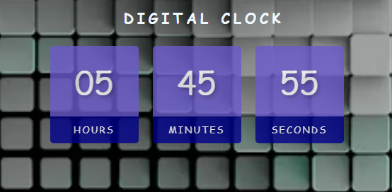

# Digital Clock

## Overview
This project is a digital clock built with HTML, CSS, and JavaScript. It displays the current time in a 12-hour format with hours, minutes, seconds, and AM/PM, updating every second. The design features a modern UI with a background image and a clean layout.

## ## Screenshots



## Features
- **Real-Time Updates**: Updates the time every second using JavaScript.
- **12-Hour Format**: Displays time in 12-hour format with AM/PM indicator.
- **Responsive Design**: Centered layout with a background image, suitable for all screen sizes.
- **Modern UI**: Styled with a background image, semi-transparent time blocks, and a cursive font.

## Tech Stack
- **HTML5**: For semantic structure.
- **CSS3**: For styling (flexbox, background image, text shadows).
- **JavaScript**: For real-time clock updates using `setInterval`.

## Installation
1. Clone the repository:
   ```bash
   git clone https://github.com/AliDevHub/digital-clock.git


## How It Works
1. The clock displays the current time in hours, minutes, seconds, and AM/PM.
2. Time updates every second using JavaScript's setInterval.
3. The design features a background image with semi-transparent time blocks for better readability.

## Contact
Feel free to reach out for collaboration or feedback: aliraza972003@gmail.com

#### Notes on the README:
- **Live Demo**: I’ve included a placeholder GitHub Pages URL (`https://alidevhub.github.io/digital-clock/`). You’ll need to enable GitHub Pages to make this link work (see Step 4 below).
<a href="https://alidevhub.github.io/dark-light-mode-toggle/">Live Demo</a>
- **Screenshot**: The README references a screenshot (`assets/image.png`). If you haven’t added a screenshot yet, 

take one of your search bar, save it in an `assets` folder, and update the repository (I’ll guide you on this if needed).
- **Contact**: Replace `aliraza972003@gmail.com` with your actual email address.